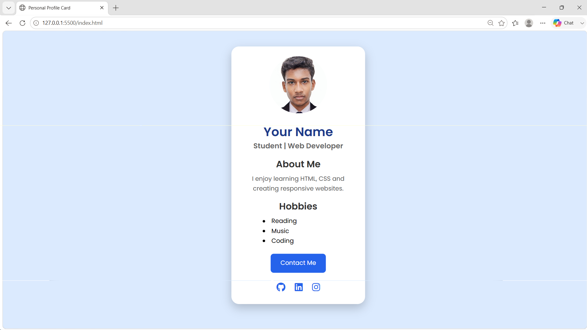

# Profile Card

## Date: 03-08-2026

## AIM
To create an interactive and responsive Personal Profile Card using HTML5 and CSS Flexbox.

## ALGORITHM

### STEP 1
Create an HTML file (`index.html`) to define the layout and structural elements of the profile card.

### STEP 2
Create a CSS file (`style.css`) to handle the visual styling, layout arrangement, and visual effects.

### STEP 3
Link the external CSS stylesheet and external resources (Google Fonts) inside the `<head>` tag of the HTML document.

### STEP 4
Structure the main card container to hold the profile image, user details, bio, hobbies list, social media links, and a contact action button.

### STEP 5
Set up the global styles, including CSS reset rules, background colors, and typography settings.

### STEP 6
Use CSS Flexbox on the `body` container to perfectly center the profile card vertically and horizontally on the page.

### STEP 7
Style the profile card with a white background, rounded corners (`border-radius`), custom padding, and a subtle drop shadow (`box-shadow`).

### STEP 8
Apply Flexbox positioning to format internal card components, such as centering the social media icons with uniform gap spacing.

### STEP 9
Add hover effects and smooth transitions to the profile card, social media icons, and the "Contact Me" button for improved interactivity.

### STEP 10
Include optimized visual media, including a circular profile image and inline SVG icons for social platforms.

### STEP 11
Test the layout responsiveness across different screen sizes using CSS media queries.

### STEP 12
Open `index.html` in a web browser to evaluate design fidelity, alignment, and functionality.

### STEP 13
Refine styling properties, adjust color contrasts, and fix alignment edge cases.

### STEP 14
Deploy the final project files (`index.html` and `style.css`) to a web server or hosting platform.

### STEP 15
Upload the project repository to GitHub Pages for free live hosting.

## PROGRAM
index.html
```
<!DOCTYPE html>
<html lang="en">
<head>
    <meta charset="UTF-8">
    <meta name="viewport" content="width=device-width, initial-scale=1.0">
    <title>Personal Profile Card</title>

    <link rel="stylesheet" href="style.css">

    <!-- Google Font -->
    <link href="https://fonts.googleapis.com/css2?family=Poppins:wght@300;400;600&display=swap" rel="stylesheet">

    <!-- Font Awesome Icons -->
    <link rel="stylesheet"
    href="https://cdnjs.cloudflare.com/ajax/libs/font-awesome/6.5.2/css/all.min.css">
</head>
<body>

<div class="card">

    

    <h1>Your Name</h1>

    <h3>Student | Web Developer</h3>

    <h2>About Me</h2>

    <p>
        I enjoy learning HTML, CSS and creating responsive websites.
    </p>

    <h2>Hobbies</h2>

    <ul>
        <li>Reading</li>
        <li>Music</li>
        <li>Coding</li>
    </ul>

    <button>Contact Me</button>

    <div class="social-icons">
        <a href="#"><i class="fab fa-github"></i></a>
        <a href="#"><i class="fab fa-linkedin"></i></a>
        <a href="#"><i class="fab fa-instagram"></i></a>
    </div>

</div>

</body>
</html>

```
style.css
```
*{
    margin:0;
    padding:0;
    box-sizing:border-box;
    font-family:'Poppins',sans-serif;
}

body{
    background:#dbeafe;
    display:flex;
    justify-content:center;
    align-items:center;
    min-height:100vh;
}

.card{
    background:white;
    width:350px;
    padding:25px;
    border-radius:20px;
    text-align:center;
    box-shadow:0 10px 25px rgba(0,0,0,0.2);
    transition:0.4s;
}

.card:hover{
    transform:translateY(-10px);
}

.card img{
    width:150px;
    height:150px;
    border-radius:50%;
    object-fit:cover;
    margin-bottom:15px;
}

h1{
    color:#1e3a8a;
}

h3{
    color:#666;
    margin-bottom:15px;
}

h2{
    margin-top:15px;
    margin-bottom:8px;
    color:#333;
}

p{
    color:#555;
    margin-bottom:15px;
}

ul{
    list-style:disc;
    text-align:left;
    margin-left:80px;
    margin-bottom:20px;
}

button{
    background:#2563eb;
    color:white;
    border:none;
    padding:12px 25px;
    border-radius:8px;
    cursor:pointer;
    font-size:16px;
    transition:0.3s;
}

button:hover{
    background:#1d4ed8;
}

.social-icons{
    margin-top:20px;
}

.social-icons a{
    color:#2563eb;
    font-size:24px;
    margin:0 10px;
    transition:0.3s;
}

.social-icons a:hover{
    color:#1d4ed8;
}

@media(max-width:400px){
    .card{
        width:90%;
    }

    ul{
        margin-left:40px;
    }
}
```

## OUTPUT

## RESULT
The program for creating a Personal Profile Card using CSS Flexbox is executed successfully.